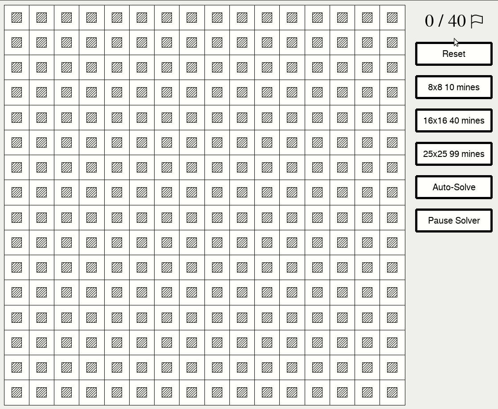

# Mines
Created by Matthew Lourenco (mattlourenco27) on github using python3

* [Game Instructions](#Game-Instructions)
* [Running the console game module](#Running-the-console-game-module)
* [Running the console solver module](#Running-the-console-solver-module)
* [GUI version of Mines](#GUI-version-of-Mines)

## Game Instructions
You can find detailed gameplay instructions [here](http://zyxyvy.wordpress.com/2012/08/11/the-rules-of-minesweeper/)

## Running the console game module
1. Visit the project directory in your terminal / console
2. Type the following command into the console:
    * `python3 game.py`
3. A console version of the mines game will begin
4. Game instructions:
    * Type 'L' or 'R' to 'Left-click' or 'Right-click' respectively
    * Follow 'L' or 'R' with the coordinates which you would like to click
    * The first coordinate is horizontal distance starting from the left column (0)
    * The second coordinate is vertical distance starting from the top row (0)
        * ex: "L 0 0" or "R 2 2" or "L 12 9"
    * Flag all of the mines on the grid or reveal all safe spaces to win

## Running the console solver module
1. Visit the project directory in your terminal /  console
2. Type the following command into the console:
    * `python3 solver.py`
3. A console version of the mines game will begin
4. The [rules](http://zyxyvy.wordpress.com/2012/08/11/the-rules-of-minesweeper/) of the game are the same as the [above console game](#Running-the-console-game-module)
5. This solver adds more functionality that can help you solve the game
6. Type any of the following commands instead of 'L' or 'R' and coordinates
    * Best: gives you the best action to take at the moment
    * Guess: uses probability to simulate all possibilities and take the next best possible move
    * Next: Does a wave of clicks starting from the middle of the grid that are guaranteed to be safe
        * Can reveal numerous tiles and flag numerous mines at once
    * Solve: solves the rest of the game from whatever point you are at
        * due to the guesswork and probabilities that are used to solve this game, it is impossible for any solver to have a 100% success rate
        * when there are no more certain safe tiles, the solver takes guesses based on calculated probability to continue

## GUI version of Mines
1. Visit the project directory in your terminal /  console
2. Type the following command into the console:
    * `python3 run.py`
3. A gui version of the mines game will begin
4. The [rules](http://zyxyvy.wordpress.com/2012/08/11/the-rules-of-minesweeper/) of the game are the same as other versions of the game above
5. Press 'Auto-Solve' at any point to have the AI solve the board

**Note**: Please ensure you are using Python3.6 or greater and have pygame1.9.6 or greater installed
